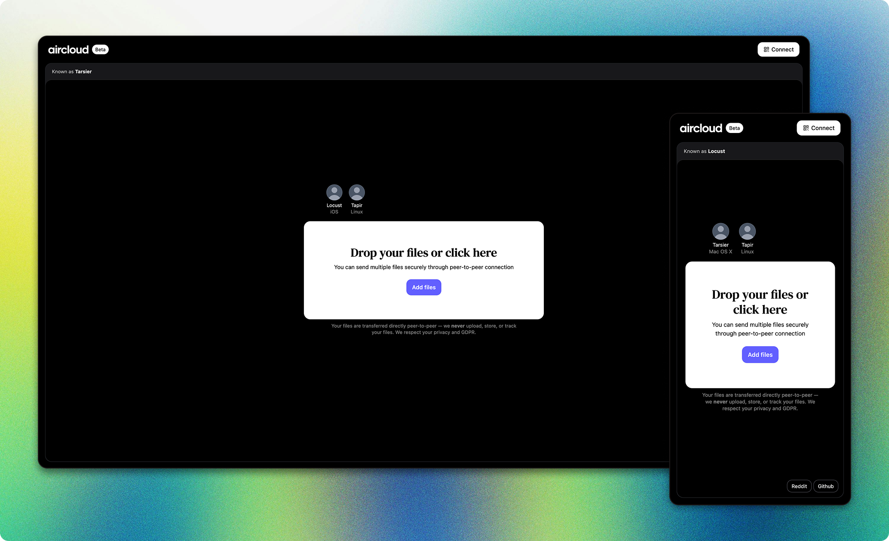

<a name="top"></a>

<div align="center">

<a href="https://github.com/m8ke/aircloud">
    <picture>
        <source media="(prefers-color-scheme: dark)" srcset="docs/aircloud-white.svg">
        <source media="(prefers-color-scheme: light)" srcset="docs/aircloud-black.svg">
        
    </picture>
</a>

<br>
<br>

<p>
<a href="https://aircloud.sh" target="_blank">AirCloud</a> is a decentralized web-based application for end-to-end encrypted file sharing built on top of WebRTC. Secure
way to transfer files across devices. We never upload, store, or track files.
</p>

</div>

<br>



## Features

<sup><a href="#top">back to top</a></sup>

| Feature                              | Description                                                                                                    |
|--------------------------------------|----------------------------------------------------------------------------------------------------------------|
| **Cross-device**                     | Use any device with a [WebRTC](https://developer.mozilla.org/en-US/docs/Web/API/WebRTC_API) supported browser  |
| **Peer-to-peer**                     | Direct connection and file transfer between peers without a central server or third-party storage              |
| **Bypass NATs and strict firewalls** | Works behind strict firewalls or NATs                                                                          |
| **Auto-discover peers**              | Detect other peers on the same network (including VPN, LAN, public Wi-Fi)                                      |
| **Manual connection**                | Connect using a 6-digit code or QR code for peers outside the same network                                     |
| **No limitations**                   | Send as many or large files as you want, everything depends on WebRTC capabilities, and network speed of peers |
| **No sign-up or ads**                | You don't see annoying ads, or need to sign-up after few transfers                                             |
| **End-to-end encryption**            | File transfers are always encrypted                                                                            |
| **Session-based**                    | All data will be deleted if you close the tab or browser                                                       |
| **PWA**                              | Progressive web application                                                                                    |
| **Self-hosted**                      | Host AirCloud on your own cloud server or homelab                                                              |
| **Anonymity**                        | Never upload, store, or track files, IPs etc                                                                   |
| **Open source**                      | Review the source code, contribute, or share ideas to improve the project                                      |

## Roadmap

<sup><a href="#top">back to top</a></sup>

| Feature                   | Milestone | Description                                                        |
|---------------------------|-----------|--------------------------------------------------------------------|
| **Local storage**         | v1        | Receive and store files decentralized on local machine             |
| **Synchronization**       | v1        | Sync locally stored files across authorized devices (peer-to-peer) |
| **Resume transfers**      | v1        | Transfers will continue after reconnection                         |
| **Metadata sanitization** | v1        | Sanitize metadata from images, videos, etc.                        |
| **Custom STUN/TURN**      | v1        | Use your preferred STUN/TURN servers                               |
| **Localization**          | v1        | Translate into multiple languages                                  |
| **Desktop app**           | v2        | Desktop application for MacOS, Windows, and Linux                  |
| **Mobile app**            | -         | Mobile application for iOS and Android                             |
| **TV app**                | -         | TV application for tvOS and Android TV                             |

## Platforms

<sup><a href="#top">back to top</a></sup>

|            | **Browser** | **Desktop app** | **Mobile app** | **TV app** |
|------------|-------------|-----------------|----------------|------------|
| **Status** | Beta        | Planned         | Planned        | Planned    |

## Technology stack

<sup><a href="#top">back to top</a></sup>

| Technology  | Scope  | Description                                                                              |
|-------------|--------|------------------------------------------------------------------------------------------|
| Spring Boot | Server | Server-side application built in Java                                                    |
| WebSocket   | Server | Signaling service to establish a WebRTC connection between peers                         |
| Coturn      | Server | Facilitate communication between devices that may be behind firewalls or NATs (optional) |
| Angular     | Client | Client-side application built in TypeScript                                              |
| WebRTC      | Client | Establish P2P connection between peers                                                   |
| Zip.js      | Client | Zip files on the client-side to send as a bundle                                         |

## Getting started

<sup><a href="#top">back to top</a></sup>

### Docker Compose

```yaml
services:
  server:
    image: ghcr.io/m8ke/aircloud/server:${AIRCLOUD_VERSION:-latest}
    restart: unless-stopped
    container_name: aircloud-server
    environment:
      PORT: ${SERVER_PORT:-8000}
      DOMAIN: ${DOMAIN}
      TURN_SECRET: ${TURN_SECRET}   # optional
      STUN_IP: stun:${DOMAIN}:3478  # optional
      TURN_IP: turns:${DOMAIN}:5349 # optional
    ports:
      - "${SERVER_PORT:-8000}:${SERVER_PORT:-8000}"

  client:
    image: ghcr.io/m8ke/aircloud/client:${AIRCLOUD_VERSION:-latest}
    restart: unless-stopped
    container_name: aircloud-client
    environment:
      PORT: ${CLIENT_PORT:-4000}
    ports:
      - "${CLIENT_PORT:-4000}:${CLIENT_PORT:-4000}"
    depends_on:
      - server
```

### TURN server

In case you need to facilitate communication between devices that may be behind firewalls or NATs, you should consider
using TURN server. Coturn server minimum requirements should be 2 CPU machine with 4 GB of RAM.

```yaml
coturn:
  image: coturn/coturn:4.7.0-alpine
  container_name: coturn
  network_mode: host
  restart: unless-stopped
  command:
    - --realm=turn.${DOMAIN}
    - --server-name=turn.${DOMAIN}
    - --use-auth-secret
    - --static-auth-secret=${TURN_SECRET}
    - --listening-ip=0.0.0.0
    - --listening-port=3478
    - --tls-listening-port=5349
    - --min-port=10000
    - --max-port=20000
    - --cert=/certs/fullchain.pem
    - --pkey=/certs/privkey.pem
    - --verbose
    - --fingerprint
    - --no-rfc5780
    - --no-tlsv1_2
    - --no-cli
    - --no-multicast-peers
    - --no-software-attribute
    - --check-origin-consistency
    - --log-file=-
```

## Recommendations

<sup><a href="#top">back to top</a></sup>

Although AirCloud prioritizes privacy when sharing files between peers, for additional security you should consider using a (self-hosted) VPN. Since we haven't
implemented [metadata removal](https://emmatrowbridge.github.io/Excuse-Me-Your-Data-Is-Leaking/2025/05/27/Exposed-by-Metadata.html), we recommend to sanitize
files, images etc., before sending.

## Support

<sup><a href="#top">back to top</a></sup>

Feel free to open an issue, submit a pull request, or simply give the project a star to show your support. You are
welcome to the [Discord](https://discord.gg/WChhuk96) server.

___

<p align="center">
Thank you!
<br>
<a href="https://aircloud.sh" target="_blank">www.aircloud.sh</a>
</p>
