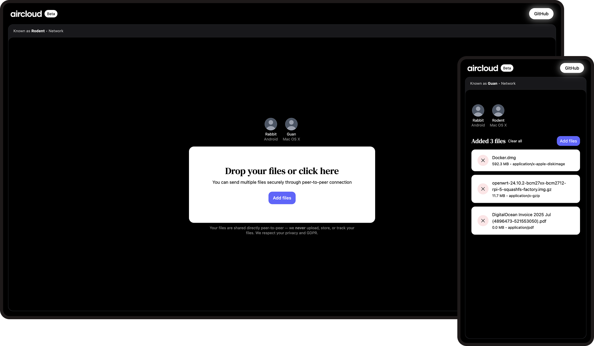

# AirCloud

AirCloud is a decentralized web-based application for end-to-end encrypted file sharing built on top of WebRTC. Secure
way to transfer files across devices. We never upload, store, or track files.

## Features

| Feature                 | Description                                                                                |
|-------------------------|--------------------------------------------------------------------------------------------|
| **Cross-device**        | Use any device with supported browser                                                      |
| **Peer-to-peer**        | Direct connection and file transfer between peers without a central server or storage      |
| **Auto discover peers** | In the same network (VPN, LAN, public WiFi etc) you can see other peers                    |
| **Connect manually**    | Use a 6-digit code or QR-code to connect with peer manually who is not in the same network |
| **Anonymity**           | We never upload, store, or track files, IPs etc                                            |
| **Open source**         | You can review the source code, contribute or help to improve with brilliant ideas         |

## Roadmap

| Feature                  | Description                                                                   |
|--------------------------|-------------------------------------------------------------------------------|
| **Metadata removing**    | Read and/or remove metadata from images, videos etc to ensure maximum privacy |
| **Dark and light theme** | Switch between dark and light theme                                           |
| **Localization**         | Translated to different languages (community help needed)                     |
| **Self-hosting**         | Docker image to provide easy self-hosting                                     |
| **Desktop app**          | Desktop app for MacOS, Windows, Linux                                         |
| **Mobile app**           | Mobile app for iOS and Android                                                |
| **TV app**               | TV app for tvOS and Android TV                                                |

## Platforms

### Browser (beta)

|               | Brave | Chrome | Firefox | Safari |
|---------------|-------|--------|---------|--------|
| **Version**   |       |        |         |        |
| **Network**   |       |        |         |        |
| **Bluetooth** |       |        |         |        |

## Technology stack

| Technology     | Description                                            |
|----------------|--------------------------------------------------------|
| Docker         | Containers                                             |
| GitHub Actions | CI/CD pipelines                                        |
| Angular        | Client-side application built in TypeScript            |
| Spring Boot    | Server-side application built in Java                  |
| WebRTC         | Establish P2P connection between two clients           |
| WebSocket      | Signaling service to exchange data between two clients |
| TailwindCSS    | CSS framework for responsive UI                        |

## Recommendations

Even though AirCloud tries to maximize the privacy when sharing files between peers, you should consider using VPN and
user-agent spoofing at the operating system level.

## Support

Feel free to open an issue or a pull request, or give a star.
