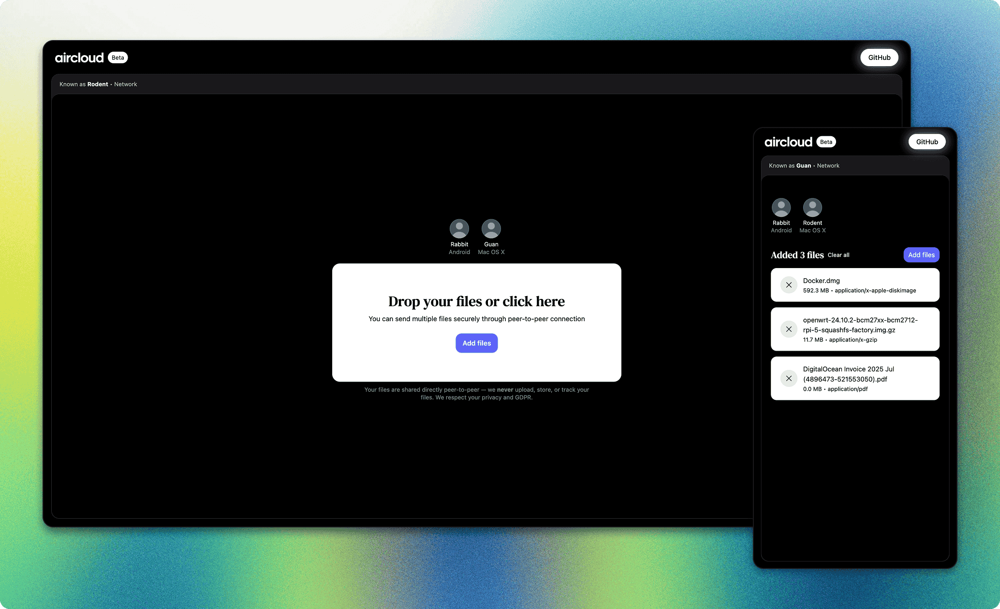

<a href="https://github.com/m8ke/aircloud">
    <picture>
          <source media="(prefers-color-scheme: dark)" srcset="docs/aircloud-white.svg">
          
    </picture>
</a>

 
 

<a href="https://aircloud.sh" target="_blank">AirCloud</a> is a decentralized web-based application for end-to-end encrypted file sharing built on top of WebRTC. Secure
way to transfer files across devices. We never upload, store, or track files.

## Features

<a href="#top">back to top</a>

| Feature                   | Description                                                                                                    |
|---------------------------|----------------------------------------------------------------------------------------------------------------|
| **Cross-device**          | Use any device with a [WebRTC](https://developer.mozilla.org/en-US/docs/Web/API/WebRTC_API) supported browser  |
| **Peer-to-peer**          | Direct connection and file transfer between peers without a central server or third-party storage              |
| **Auto-discover peers**   | Detect other peers in the same network (including VPN, LAN, public Wi-Fi)                                      |
| **Manual connection**     | Connect using a 6-digit code or QR code for peers outside the network                                          |
| **No limitations**        | Send as many or large files as you want, everything depends on WebRTC capabilities, and network speed of peers |
| **No sign-up or ads**     | You don't see annoying ads, or need to sign-up after few transfers                                             |
| **End-to-end encryption** | File transfers are always encrypted                                                                            |
| **Session-based**         | All data will be deleted if you close the tab or browser                                                       |
| **Anonymity**             | Never upload, store, or track files, IPs etc                                                                   |
| **Open source**           | Review the source code, contribute, or share ideas to improve the project                                      |

## Roadmap

<a href="#top">back to top</a>

| Feature                  | Description                                                                      |
|--------------------------|----------------------------------------------------------------------------------|
| **Metadata removal**     | Read and/or remove metadata from images, videos, etc., to ensure maximum privacy |
| **Localization**         | Translate into multiple languages (community contributions welcome)              |
| **Self-hostable**        | Docker image to provide easy self-hosting                                        |
| **Dark and light theme** | Toggle between dark and light modes                                              |
| **Desktop app**          | Desktop application for MacOS, Windows, and Linux                                |
| **Mobile app**           | Mobile application for iOS and Android                                           |
| **TV app**               | TV application for tvOS and Android TV                                           |

## Platforms

<a href="#top">back to top</a>

|            | **Browser** | **Desktop app** | **Mobile app** | **TV app** |
|------------|-------------|-----------------|----------------|------------|
| **Status** | Beta        | Planned         | Planned        | Planned    |

## Technology stack

<a href="#top">back to top</a>

| Technology     | Scope          | Description                                                        |
|----------------|----------------|--------------------------------------------------------------------|
| Docker         | Core           | Containerization                                                   |
| GitHub Actions | Core           | CI/CD pipelines                                                    |
| Spring Boot    | Server         | Server-side application built in Java                              |
| Angular        | Client         | Client-side application built in TypeScript                        |
| WebRTC         | Client         | Establish P2P connection between clients                           |
| Zip.js         | Client         | Zip files on client-side to send as a bundle                       |
| WebSocket      | Client, Server | Signaling service to establish a WebRTC connection between clients |

## Recommendations

<a href="#top">back to top</a>

Although AirCloud prioritizes privacy when sharing files between peers, for additional security you should consider
using a (self-hosted) VPN and user-agent spoofing at the operating system level.

## Support

<a href="#top">back to top</a>

Feel free to open an issue, submit a pull request, or simply give the project a star to show your support.

___

Thank you!

